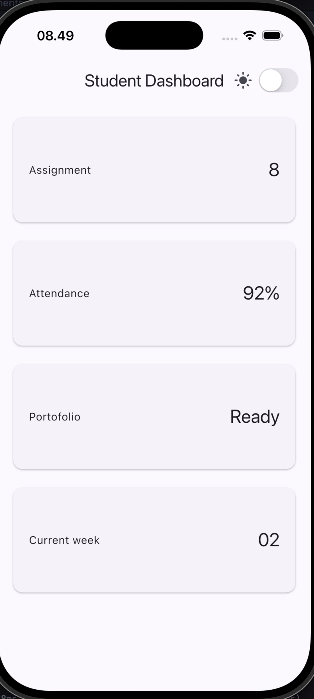
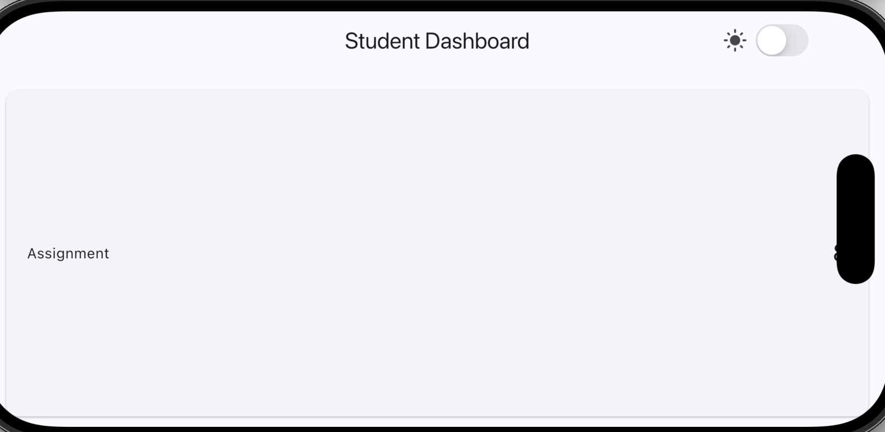
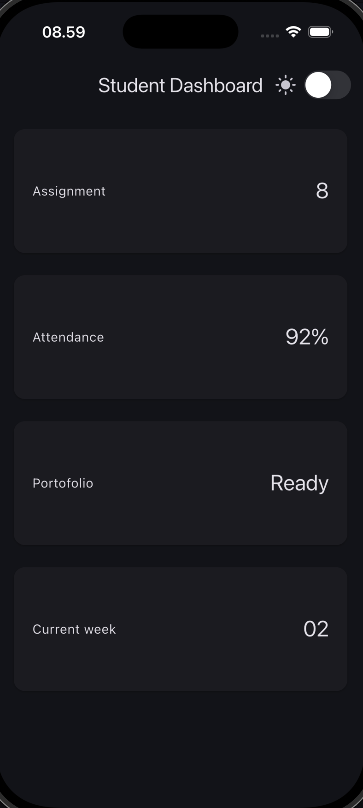
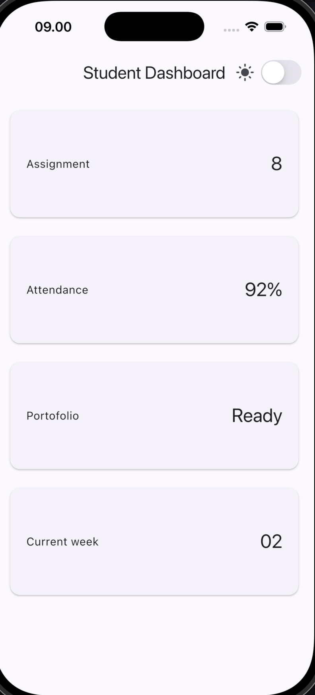
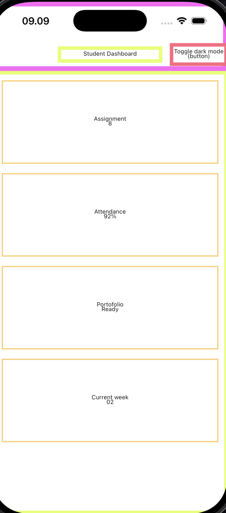
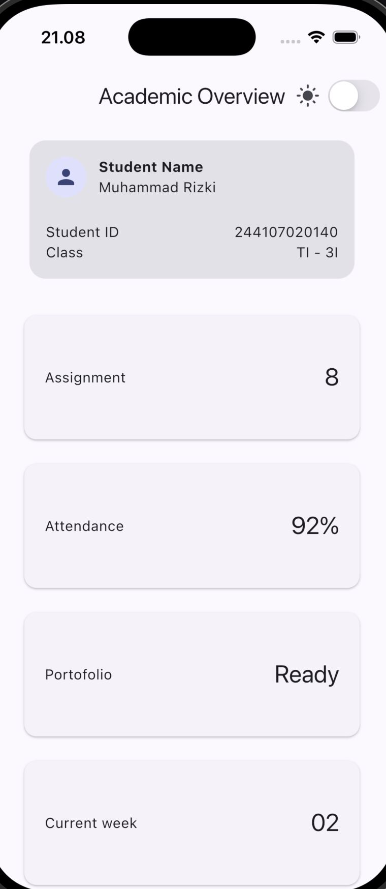
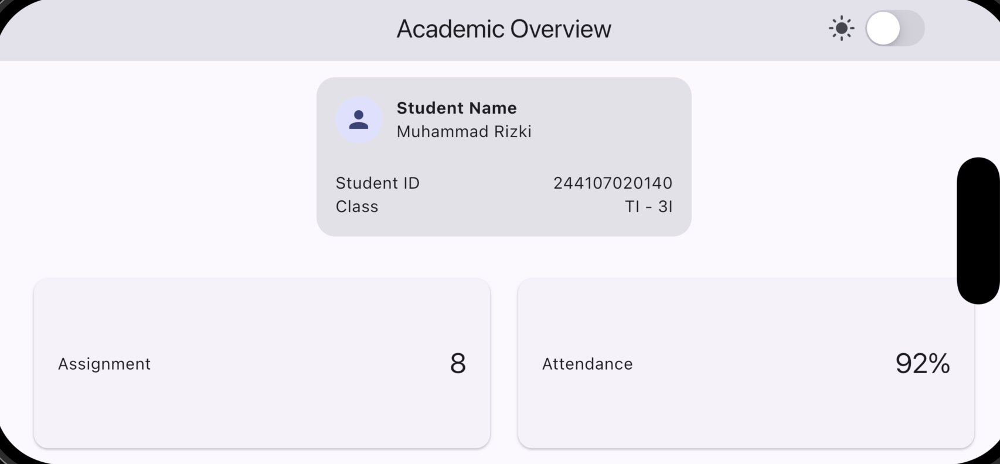
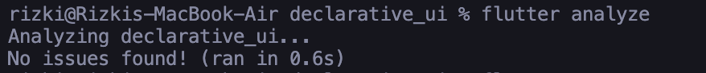
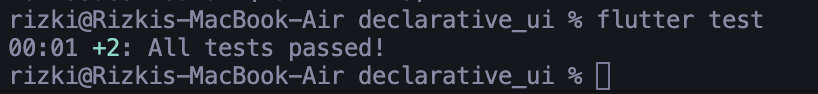

# Layout Experiments
1. Change the 700 breakpoint and observe the column count.
- Change to 1000 breakpoint
 
 
- default 700 breakpoint
.png)
.png)
- observation: because even in landscape mode, the width does not reach 1000 pixels then the layout remains constrained to 1 column across both potrait and landscape modes.

2. Change themeMode to ThemeMode.dark, then restore ThemeMode.system
- ThemeMode.dark

3. Test the application at different emulator screen size
- .png)
.png)

4. Add Semantics or meaningful labels to important screen-reader elements.
- 

---

# Main Assignment
Narrow-screen

Wide-screen

---

# AI Prompt Challenge
1. Design prompt. Submit this prompt (or a variation): "Compare two Flutter academic dashboard layouts: a GridView version and a LayoutBuilder + Column version. Explain the responsive and accessibility trade-offs."
- Layout builder + Column because it reacts to the parent's actual constraints (not just screen width), so it stays correct if nested in a side panel, and it handles uneven card content/scroll nesting better. GridView only wins on brevity for a simple uniform grid — not worth it here.

2. Concept-reinforcement prompt. "Explain when using Expanded actually causes an overflow inside a Row; show failing example code and its fix."
- it's an Expanded inside a Row whose parent gives it unbounded width, or unhandled long text. Fix: overflow: TextOverflow.ellipsis + maxLines: 1 on the text, and don't nest a second flex Row inside a Row without giving it a bounded width first.

3. Verification prompt. Ask the AI to audit its own output: "Review the layout recommendation above: does it stay responsive below 600px, does it reduce accessibility, and are all widgets available in the current stable Flutter?"
- Yes it stays responsive below 600px (checked via constraints.maxWidth), no accessibility reduction as long as you add Semantics labels and check tap targets ≥48dp, and all widgets used (LayoutBuilder, Wrap, Column, Expanded, Semantics) are stable

4. Prompt: After completing the independent implementation, use AI only to compare two layout alternatives. Work through the following challenge:
Design prompt. Submit this prompt (or a variation): "Compare two Flutter academic dashboard layouts: a GridView version and a LayoutBuilder
Column version. Explain the responsive and accessibility trade-offs."
Concept-reinforcement prompt. "Explain when using Expanded actually causes an overflow inside a Row; show failing example code and its fix."
Verification prompt. Ask the AI to audit its own output: "Review the layout recommendation above: does it stay responsive below 600px, does it reduce accessibility, and are all widgets available in the current stable Flutter?"
Document it. Store the prompt, relevant output, selected decision, technical reasoning, and verification evidence (tests/screenshots) in this week's assignment README.
Passing criteria: the AI suggestion you adopt actually works, remains responsive, does not reduce accessibility, and you can explain every decision during code review, not merely copy the AI output.

---

# Refactoring Challenge

---

# Basic Testing

---

# Reflection
1. How does imperative thinking differ from declarative thinking when building UI?
- Imperative = manually mutate the UI step by step.
Declarative = describe what the UI should look like for a given state and let flutter rebuild it.

2. When does Expanded help, and when can it cause a layout error?
- Helps when a child should fill leftover space in a Row/Column. Breaks when its parent doesn't give it a bounded constraint causing RenderFlex unbounded errors.

3. How do breakpoints and themes affect user experience?
- Breakpoints control density, 1 column avoids cramping on phones, 2 columns uses space on tablets. Themes keep colors/contrast consistent across light/dark mode instead of some widgets staying hardcoded.

4. What did you verify after receiving an AI design recommendation?
- Didn't trust it blindly, ran flutter test to confirm the fix actually passed at both widths, then visually checked the app and noticed it changed the design, which I had to catch and judge myself, not something the AI flagged.