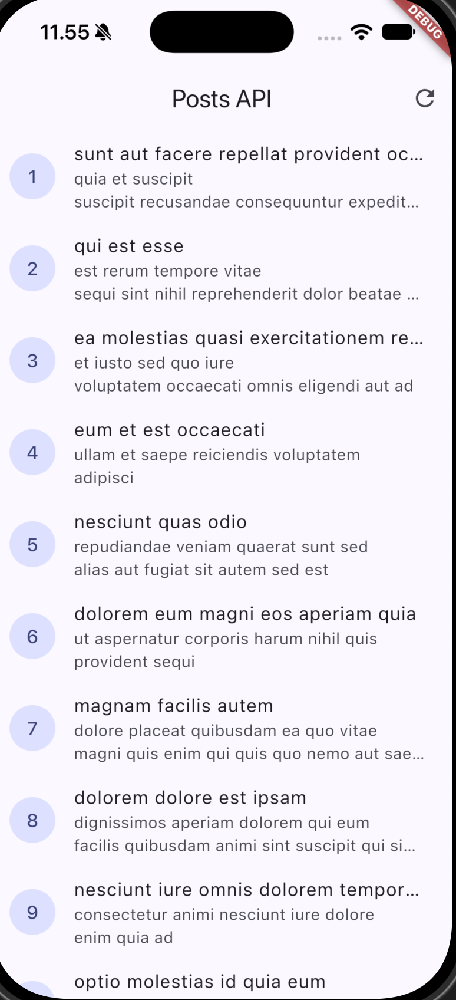
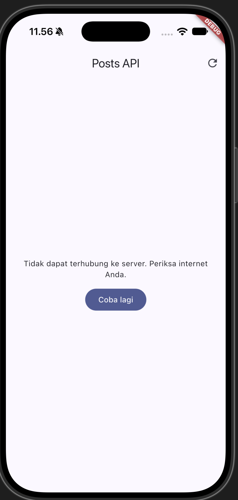
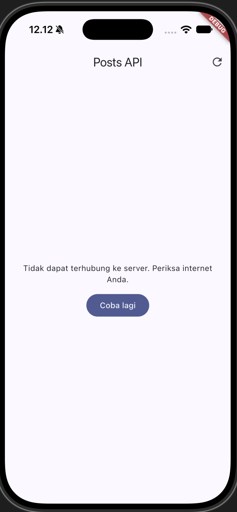
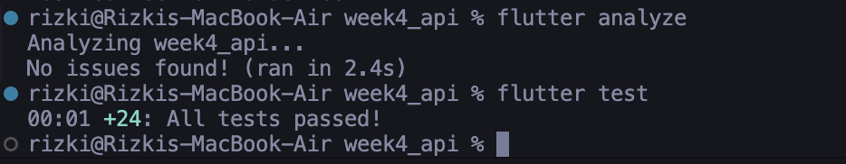

# Week 4 — Networking & REST API

A Flutter REST API client application implementing clean architecture, modern state management with **Riverpod**, centralized HTTP networking via **Dio**, server-side pagination, declarative navigation with **GoRouter**, comprehensive **AI Challenge** documentation, and learning reflections.

---

## Screenshots

| Normal Connection (Success State) | No Connection (Error State) |
|:---:|:---:|
|  |  |

| Base URL Configuration | Test Results (All Tests Passed) |
|:---:|:---:|
|  |  |

---

## Project Objectives

1. Build a resilient REST API network layer using **Dio** with centralized timeout settings and logging interceptors.
2. Implement strict **Separation of Concerns** via the **Repository Pattern**, guaranteeing that the UI layer never communicates with the HTTP client directly.
3. Manage asynchronous data lifecycles declaratively using **Riverpod (AsyncNotifier & FutureProvider)** with comprehensive support for four essential UI states: *loading*, *error* (+ *retry*), *empty*, and *success*.
4. Implement infinite-scroll pagination protected against race conditions and concurrent requests with dedicated state guards.
5. Apply declarative routing using **GoRouter** (`/` and `/post/:id`) with smart state caching on post details.
6. Guarantee code quality and reliability through automated testing (*unit tests* for models, error mapping, fake repository provider tests, and *widget tests*).

---

## Key Features

- **Centralized HTTP Client (`api_client.dart`)**:
  - Single `baseUrl`: `https://jsonplaceholder.typicode.com`.
  - Centralized `connectTimeout` and `receiveTimeout` configured to 10 seconds each.
  - `LogInterceptor` for inspecting requests and responses in debug mode.
- **Null-Safe Models (`post.dart` & `comment.dart`)**:
  - Resilient `fromJson` deserialization protecting against `null` values, absent keys, and numerical type mismatches (`num?.toInt()`).
- **Complete Four-State UI Handling**:
  - **Loading**: Circular progress indicator displayed during fetches.
  - **Error**: Clear, user-friendly error messages accompanied by a retry button.
  - **Empty**: Informative placeholder when the server returns an empty list.
  - **Success**: Data list with pull-to-refresh support.
- **Server-Side Pagination (`paged_posts.dart` & `paged_post_page.dart`)**:
  - Paginated fetching using `_page` and `_limit=10` query parameters.
  - Concurrent request protection: guards preventing redundant requests during in-flight operations (`isLoadingMore`) or when the end of data is reached (`!hasMore`).
- **Extracted Reusable Widget (`PostTile`)**:
  - Individual post row extracted into `lib/widgets/post_tile.dart`, keeping `ListView.builder` minimal and enabling isolated widget testing.
- **Centralized Network Error Handling (`network_errors.dart`)**:
  - `friendlyErrorMessage` maps all `DioExceptionType` variants:
    - Timeouts (`connectionTimeout`, `sendTimeout`, `receiveTimeout`)
    - Physical connectivity issues (`connectionError`)
    - HTTP status codes (`404` Not Found, `401`/`403` Access Denied, `500` Server Error)
    - Fallback for unexpected exceptions
- **Declarative Navigation via GoRouter (`router.dart`)**:
  - Routes for `/` (main post list) and `/post/:id` (detailed post view with comments).
  - **Smart Detail State (`postDetailProvider`)**: If a post has already been loaded in memory, it renders immediately without additional network calls. If accessed directly via deep link or URL, it fetches fresh data from `PostRepository.fetchPost(id)`.

---

## Technology Stack

- **Framework**: Flutter SDK (Dart 3.x)
- **HTTP Client**: [Dio `^5.11.1`](https://pub.dev/packages/dio)
- **State Management**: [flutter_riverpod `^3.4.3`](https://pub.dev/packages/flutter_riverpod)
- **Routing**: [go_router `^18.0.1`](https://pub.dev/packages/go_router)
- **Design System**: Material Design 3

---

## Directory Structure

```
lib/
├── data/
│   ├── api_client.dart                  # Centralized Dio client (BaseOptions, 10s Timeouts, Logging)
│   ├── network_errors.dart              # DioException to user-friendly message mapping
│   ├── models/
│   │   ├── comment.dart                 # Comment model (null-safe fromJson, toJson, equality)
│   │   └── post.dart                    # Post model (null-safe fromJson, toJson)
│   ├── repositories/
│   │   ├── comment_repository.dart      # CommentRepository with fetchComments(postId)
│   │   └── post_repository.dart         # PostRepository with fetchPosts(), fetchPostsPage(), fetchPost(id)
│   ├── paged_posts.dart                 # Server-side pagination state & notifier
│   └── providers.dart                   # Riverpod Providers (Dio, repositories, notifiers, test helpers)
├── pages/
│   ├── paged_post_page.dart             # Infinite scroll paginated post page
│   ├── post_detail_page.dart            # Post detail page (/post/:id) & comments
│   └── post_list_page.dart              # Main post list page
├── widgets/
│   └── post_tile.dart                   # Reusable PostTile widget
├── router.dart                          # GoRouter configuration
└── main.dart                            # Application entry point (MaterialApp.router)

test/
├── comment_test.dart                    # 7 unit tests for Comment model & edge cases
├── network_errors_test.dart             # 8 unit tests for DioException mapping
├── post_detail_test.dart                # 2 unit tests for cached vs direct fetch detail
├── post_test.dart                       # 4 unit tests for model, error mapping & fake repo
├── post_tile_test.dart                  # 2 widget tests for PostTile
└── widget_test.dart                     # Application smoke test with ProviderScope

screenshots/                             # Screenshots verifying UI states and test results
```

---

## Getting Started

### 1. Install Dependencies
```bash
flutter pub get
```

### 2. Run Static Analysis (Linter)
```bash
flutter analyze
```
*Result: `No issues found!`*

### 3. Run Automated Tests
```bash
flutter test
```
*Result: `All 24 tests passed!`*

### 4. Launch Application
```bash
flutter run
```

---

## AI Challenge Documentation

This section details the end-to-end AI Challenge workflow, encompassing initial prompts, defect discovery, corrective measures, and architectural design decisions.

### 1. Prompts Provided

#### Prompt 1: Repository Layer & Comment Model Implementation
```
Buatkan repository layer Flutter untuk endpoint GET /comments?postId={id}
dari JSONPlaceholder menggunakan Dio + flutter_riverpod.
Requirements:
- Model Comment dengan fromJson aman null (postId, id, name, email, body).
- CommentRepository dengan method fetchComments(postId) + timeout 10 detik.
- AsyncNotifierProvider dengan penanganan error otomatis (AsyncError)
  dan fungsi pesan error ramah pengguna untuk timeout, connection error, 404, dan 500.
- Satu unit test untuk fromJson dengan field yang hilang.
Jelaskan setiap bagian kode dalam komentar.

AI Verification Checklist:
1. Apakah UI memanggil Dio secara langsung (dilarang) atau lewat repository?
2. Apakah fromJson aman null, atau masih memakai cast langsung yang bisa crash?
3. Apakah semua tipe DioExceptionType (timeout, connectionError, badResponse) dipetakan ke pesan pengguna?
4. Apakah baseUrl/timeout terpusat di satu client, bukan tersebar di tiap method?
5. Apakah test AI benar-benar menguji kasus field hilang, atau hanya happy path? Tambahkan minimal 1 edge case sendiri.
6. Jalankan flutter analyze dan flutter test, apakah hasil AI lolos tanpa warning?
```

#### Prompt 2: Refactoring Challenge
```
Refactoring Challenge:
1. Ekstrak widget baris post menjadi PostTile tersendiri agar ListView.builder pendek dan mudah diuji.
2. Pindahkan friendlyErrorMessage ke file lib/data/network_errors.dart agar bisa dipakai ulang halaman paged dan non-paged.
3. Tambahkan halaman detail post dengan GoRouter (/post/:id) yang menampilkan title dan body lengkap, state detail diambil dari list yang sudah dimuat atau via repository bila langsung dibuka.
```

#### Prompt 3: Hermetic Unit Testing
```
Testing: unit test model + mock repository
Buat test/post_test.dart, uji parsing aman null, mapping error, dan provider dengan repository palsu (tanpa internet).
```

---

### 2. Discovered AI Code Issues & Applied Solutions

| No | Component | Initial Issue in AI Generation | Implemented Solution & Correction |
|:---:|---|---|---|
| **1** | **Riverpod Notifier Hierarchy** | The AI attempted to inherit from `FamilyAsyncNotifier<List<Comment>, int>`, a non-existent/outdated class in Riverpod 3.x, causing compilation failure `extends_non_class`. | Adopted official Riverpod 3 architecture: `AsyncNotifierProvider.family` where the notifier extends standard `AsyncNotifier<List<Comment>>` and receives family parameters via constructor dependency injection. |
| **2** | **Model Parsing & Number Types** | The AI used rigid casts such as `as int? ?? 0`, which throws a runtime `TypeError` when the JSON decoder parses numerical values as `double` (e.g., `1.0`). | Refactored to `(json['postId'] as num?)?.toInt() ?? 0` and `json['name'] as String? ?? ''`, safely accommodating `null`, `double`, and `int` types. |
| **3** | **Pending Timers in Widget Tests** | Running smoke tests on `MyApp` triggered default `dioProvider` initialization with an active 10-second timeout timer, causing `!timersPending` test failure upon teardown. | Overrode `postRepositoryProvider` with `FakePostRepository` in `ProviderScope` during widget tests, allowing tests to run hermetically and instantly. |
| **4** | **Post Detail State Caching** | The detail route `/post/:id` initially triggered an unnecessary server request on every transition even when data was already in memory. | Utilized `ref.read(postListProvider)` in `postDetailProvider`. If the post already exists in the loaded list, it is retrieved synchronously from memory without additional network calls. |

---

### 3. Technical Rationale

1. **Centralization of `lib/data/network_errors.dart`:**
   Prevents redundant exception handling and translation logic across different UI screens. Every view (`PostListPage`, `PagedPostPage`, `PostDetailPage`) references the same single-source function `friendlyErrorMessage()`.
2. **Extraction of `lib/widgets/post_tile.dart`:**
   Enforces Single Responsibility Principle. Isolating post item presentation from `ListView.builder` simplifies the list logic and enables independent widget testing.
3. **Decoupled `lib/data/api_client.dart`:**
   Centralizes `baseUrl`, `connectTimeout`, `receiveTimeout`, and `LogInterceptor` inside a factory method `createDio()`. This allows switching environments (development, staging, production) without altering repository implementations.
4. **Declarative Navigation via GoRouter:**
   Simplifies deep-link URL parsing (`/post/:id`), maintains a structured navigation stack, and separates routing logic from the widget hierarchy.

---

### 4. AI Verification Checklist Table

| Verification Criterion | Status | Technical Analysis |
|---|:---:|---|
| **1. UI does not call Dio directly** | **PASS** | The UI communicates exclusively via Riverpod providers and repositories. No Dio instance is accessed from UI widgets. |
| **2. Null-safe & type-resilient fromJson** | **PASS** | Utilizes nullable casting `as num?` and `as String?` combined with default fallback operator `??`. Eliminates runtime type cast crashes. |
| **3. Complete DioExceptionType mapping** | **PASS** | `connectionTimeout`, `sendTimeout`, `receiveTimeout`, `connectionError`, and `badResponse` (404, 401, 403, 500+) are mapped to friendly user messages. |
| **4. Centralized base URL and timeout** | **PASS** | Configured once in `createDio()` inside `lib/data/api_client.dart` (10-second timeout, JSONPlaceholder base URL). |
| **5. AI tests cover edge cases** | **PASS** | Test suite validates empty JSON `{}`, explicit `null` fields, `double` values, network failures, equality contracts, and fake repositories (24 tests total). |
| **6. Clean flutter analyze & flutter test** | **PASS** | `flutter analyze` reports 0 issues and `flutter test` reports 24/24 passing tests with zero warnings or failures. |

---

## Learning Reflections

### 1. Why is the UI prohibited from calling Dio directly? What breaks if this rule is violated?
* **Separation of Concerns (SoC):** The sole responsibility of the UI layer is presenting data on screen and handling user interactions. Calling Dio directly inside widgets contaminates the UI with low-level HTTP networking concerns, such as endpoint paths, query parameters, JSON serialization, headers, and HTTP status codes.
* **Compromised Testability:** When widgets depend directly on Dio, UI widget tests cannot run in isolation without an active internet connection. Developers would be forced to mock low-level HTTP socket adapters, which is brittle and complex. With a Repository Layer, dependencies can be swapped with a lightweight `FakePostRepository` or mock provider, allowing fast, deterministic, and hermetic tests.
* **Violation of the DRY Principle (Don't Repeat Yourself):** If an endpoint URL or response payload structure changes (for instance, migrating from `/posts` to `/api/v2/posts`), every widget invoking that endpoint must be updated individually. A repository confines the change to a single source file.
* **Tight Architectural Coupling:** If the application ever needs to replace Dio with another client (such as standard `http`, GraphQL, or a local offline-first SQLite/Hive cache), the entire presentation layer would be broken and require complete rewrites.

---

### 2. When is client-side pagination sufficient, and when must server-side pagination (_page/_limit) be used?
* **Client-Side Pagination is Sufficient When:**
  1. **Dataset is Small and Bounded:** The total record count is known to be small (e.g., fewer than 100 items or total payload under a few dozen kilobytes).
  2. **Data is Static:** The dataset rarely changes during the active session (e.g., static lists of cities, countries, or app configuration options).
  3. **Instant In-Memory Sorting and Filtering is Needed:** Having the entire dataset locally in memory allows users to perform instantaneous search, filtering, and sorting without incurring network latency on every keystroke.
* **Server-Side Pagination (`_page`/`_limit` or Cursor-Based) is Mandatory When:**
  1. **Dataset is Large or Unbounded:** The data comprises thousands or millions of records (e.g., social media feeds, transaction logs, e-commerce product catalogs).
  2. **Bandwidth and Data Conservation:** Mobile users often only view the first few items. Downloading thousands of records upfront wastes cellular data.
  3. **Preventing Out-Of-Memory (OOM) Crashes:** Mobile RAM is constrained. Deserializing tens of thousands of JSON objects into the heap leads to severe garbage collection pauses, frame drops, and application termination due to OOM.
  4. **Highly Dynamic Data:** Server records change frequently in real time; requesting data in chunks ensures users receive the most up-to-date state as they scroll.
  5. **Server Compute Efficiency:** Executing database queries with `LIMIT 10 OFFSET 20` uses a fraction of the compute and memory resources compared to returning entire tables in a single response.

---

### 3. How do repository exceptions turn into AsyncError without try/catch in every widget? When is explicit try/catch still needed?
* **Riverpod's Declarative Error Handling Mechanism:**
  In Riverpod, the `build()` method of an `AsyncNotifier` (or the callback function in a `FutureProvider`) runs inside an internal asynchronous error zone managed by Riverpod. If the repository throws an exception (such as a `DioException` when network connectivity drops), Riverpod automatically catches the exception and transitions the provider state into `AsyncError(error, stackTrace)`. In the UI layer, widgets consume this state declaratively via pattern matching:
  ```dart
  asyncValue.when(
    data: (data) => ListView(...),
    loading: () => CircularProgressIndicator(),
    error: (err, stack) => Text(friendlyErrorMessage(err)),
  );
  ```
  This eliminates repetitive `try-catch` blocks across all widget build methods.
* **When is Explicit `try/catch` Still Required?**
  1. **User Actions and Side-Effects:** Operations triggered from UI event callbacks (such as pressing a "Submit" button, deleting an item, or invoking a custom `refresh()` method) execute outside the automatic `build()` lifecycle. Explicit `try-catch` blocks are needed inside notifier methods to set `state = AsyncError(e, st)` safely, or in the UI callback to trigger transient feedback like a `SnackBar` or error dialog.
  2. **Local Fallback and Offline Degradation:** Inside the repository layer, explicit `try-catch` is necessary when implementing cache-fallback strategies (e.g., attempting a network request first, and if offline, catching the failure to return local SQLite/Hive cached data).
  3. **Exception Transformation and Domain Modeling:** When low-level transport exceptions (e.g., `SocketException`, `HttpException`) need to be converted and rethrown as custom domain-specific exceptions before propagating upward.

---

### 4. Which parts of the AI-generated code did you modify, and why?
* **Correction 1: Riverpod 3 Notifier Hierarchy (`FamilyAsyncNotifier` to `AsyncNotifier`)**:
  - *Discovery*: The AI generated code extending `FamilyAsyncNotifier<List<Comment>, int>`, which is invalid in Riverpod 3.4+.
  - *Modification*: Refactored to official Riverpod 3 syntax using `AsyncNotifierProvider.family` where the notifier class extends standard `AsyncNotifier<T>` and receives the family argument through constructor injection.
  - *Rationale*: Resolves the `extends_non_class` compile error and guarantees forward compatibility with modern Riverpod releases.
* **Correction 2: Null-Safety and Type Resilience in `Comment` and `Post` Models**:
  - *Discovery*: The AI initially produced rigid casts such as `(json['postId'] as int)` that fail with a fatal `TypeError` whenever the backend returns floating-point numbers (`1.0`) or missing/null values.
  - *Modification*: Applied defensive parsing using `(json['postId'] as num?)?.toInt() ?? 0` and `(json['title'] as String?) ?? ''`.
  - *Rationale*: Protects the application from unexpected crashes when handling malformed or incomplete backend payloads.
* **Correction 3: Eliminating Pending Timers in Widget Tests**:
  - *Discovery*: The application smoke test (`widget_test.dart`) failed with `!timersPending` because `MyApp` instantiated the default `dioProvider`, which maintains an active 10-second network timeout timer upon widget disposal.
  - *Modification*: Injected `FakePostRepository` via `ProviderScope.overrides` during the test run.
  - *Rationale*: Eliminates network timer dependencies in UI tests, ensuring immediate, reliable, and hermetic execution.
* **Correction 4: Smart State Caching for GoRouter `/post/:id`**:
  - *Discovery*: The initial AI implementation always initiated a duplicate network request whenever navigating to the post detail screen.
  - *Modification*: Utilized `ref.read(postListProvider)` within `postDetailProvider`. If the selected post is already present in the pre-loaded list state, it is returned immediately from memory. A network call is only executed if the post detail is opened directly via a deep link or browser refresh.
  - *Rationale*: Significantly improves user experience and perceived performance by rendering the detail screen instantaneously without loading delays.
