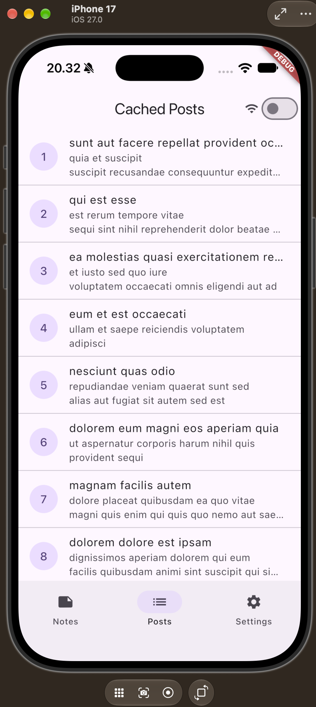
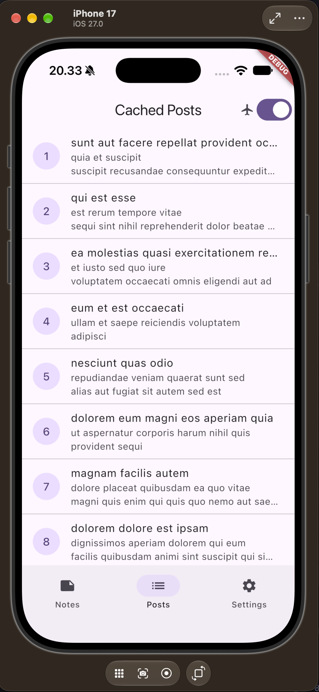

# Week 5: Local Storage and Offline-First Notes App

## 1. Objective
This project is an Offline-First Notes application built with Flutter, focusing on robust local persistence, cache-first network reads, dirty-flag sync queues, and seamless offline capability. The application ensures zero data loss and an uninterrupted user experience regardless of network connectivity.

---

## 2. Tech Stack
* Framework: Flutter (SDK ^3.13.2)
* State Management: Flutter Riverpod (^3.4.3)
* Local Relational Database: sqflite (^2.4.4) + path (^1.9.1)
* Key-Value Store: shared_preferences (^2.5.5)
* Routing: go_router (^18.0.2)
* HTTP Client: dio (^5.11.1)

---

## 3. Main Features

### 3.1 Preferences Management (SharedPreferences)
* Dark Mode / Light Mode theme toggle with reactive app-wide theme updates.
* Last-opened timestamp tracked on application startup and displayed in the Settings tab.

### 3.2 Persistent Note CRUD (SQLite / sqflite)
* Full CRUD operations (Create, Read, Delete) stored persistently in local SQLite (`offline_notes.db`).
* Notes list automatically ordered by newest `updated_at DESC`.
* Decoupled architecture: UI interacts solely via Riverpod providers and repositories.

### 3.3 Offline-First Architecture
* **Cache-First Reads**: API posts from JSONPlaceholder are served immediately from the local SQLite cache table (`cached_posts`), followed by a background network refresh.
* **Dirty Flag Tracking**: Newly created or modified notes are marked with `dirty = 1` (`dirty: true`).
* **Sync Queue**: A dedicated `syncNotes()` service simulates remote synchronization, updating dirty records to `dirty = 0` on completion.
* **Deterministic Offline Simulation**: A `forceOffline` toggle in Settings and the Posts screen allows testing offline workflows deterministically without toggling system Wi-Fi.

### 3.4 Explicit Conflict Resolution Rule
In offline-first synchronization, concurrent modifications between the local client and remote server require an unambiguous reconciliation policy:
* **Strategy: Last-Write-Wins (LWW) based on `updated_at` ISO-8601 timestamps.**
* **Client Write Handling**: Every local modification stamps the note with `DateTime.now()` and sets `dirty = 1`.
* **Synchronization Reconciliation**:
  1. During `syncNotes()`, the client sends all dirty records along with their `updated_at` timestamp.
  2. If the server copy was updated after the client's `updated_at`, the server version takes precedence.
  3. If the client's `updated_at` is newer, the server overwrites its record with the client's payload.
  4. Upon receiving a 2xx HTTP response, the local repository executes `markAllSynced()` (`UPDATE notes SET dirty = 0 WHERE dirty = 1`).

### 3.5 Refactored Architecture
* **Dedicated `NoteTile` Widget**: Encapsulated note item display with an "unsynced" badge when `dirty == true`.
* **Modular `lib/data/sync.dart`**: Caching and synchronization logic extracted into a separate domain service, keeping repository classes focused strictly on CRUD.
* **Deep Routing with GoRouter**: Navigation powered by GoRouter (`/notes`, `/posts`, `/settings`, and `/note/:id`), where `/note/:id` queries the local repository directly by ID rather than relying on list state.

---

## 4. Project Structure

```
05-week-5-local-storage-offline-first/week5_offline_notes/
├── docs/
│   └── ai_challenge_storage_comparison.md  # Storage comparison and AI verification
├── lib/
│   ├── data/
│   │   ├── local/
│   │   │   ├── db.dart                     # SQLite openNotesDb and table schemas
│   │   │   └── note.dart                   # Note entity with serialization
│   │   ├── models/
│   │   │   └── post.dart                   # Post model with defensive casting
│   │   ├── repositories/
│   │   │   ├── cached_post_repository.dart # SQLite cached_posts CRUD
│   │   │   ├── note_repository.dart        # SQLite notes CRUD
│   │   │   └── post_repository.dart        # REST API client via Dio
│   │   ├── api_client.dart                 # Centralized Dio configuration
│   │   ├── prefs.dart                      # SharedPreferences repository
│   │   └── sync.dart                       # Sync queue and cache-first services
│   ├── pages/
│   │   ├── note_detail_page.dart           # Route /note/:id reading from repository
│   │   ├── notes_page.dart                 # Notes list, dirty badge, and sync trigger
│   │   ├── post_list_page.dart             # Cache-first posts view
│   │   └── settings_page.dart              # Theme, force-offline, and last-opened view
│   ├── providers/
│   │   └── providers.dart                  # Riverpod providers wiring all layers
│   ├── widgets/
│   │   └── note_tile.dart                  # Extracted note item widget
│   └── main.dart                           # Entry point and GoRouter setup
├── screenshots/
│   ├── before_airplane.png                 # Proof: dirty notes with sync badge
│   └── after_airplane.png                  # Proof: notes synced, badge cleared
├── test/
│   ├── note_test.dart                      # Model serialization and fake repo tests
│   └── widget_test.dart                    # App shell and navigation tests
└── pubspec.yaml
```

---

## 5. How to Run

### 5.1 Run Application
```bash
flutter pub get
flutter run
```

### 5.2 Run Static Analysis
```bash
flutter analyze
```
Expected output: `No issues found!`

### 5.3 Run Tests
```bash
flutter test
```
Expected output:
```
00:00 +0: fromMap is safe against missing fields
00:00 +1: dirty flag survives serialization
00:00 +2: provider succeeds with a fake repository
00:00 +3: provider fails with a fake repository
00:00 +4: App renders with bottom navigation
00:00 +5: Can switch tabs via bottom navigation
00:00 +6: All tests passed!
```

---

## 6. Verification and Results
* **Analysis**: `flutter analyze` passes with 0 warnings and 0 errors.
* **Unit and Widget Tests**: All 6 tests pass cleanly.
* **AI Challenge**: Complete analysis comparing SharedPreferences, Hive, sqflite, and Drift documented in `docs/ai_challenge_storage_comparison.md`.

### 6.1 Offline Sync Verification (Airplane Mode Proof)

| Before Sync (Airplane Mode / Dirty State) | After Sync (Reconnected / Synced State) |
| :---: | :---: |
|  |  |
| **Status: Unsynced (`dirty = 1`)**<br>• Notes created locally in SQLite while offline.<br>• AppBar sync icon displays badge with count `2`.<br>• Each item displays an orange "unsynced" badge. | **Status: Synced (`dirty = 0`)**<br>• `syncNotes()` completed remote sync.<br>• Records marked clean (`dirty = 0`) in SQLite.<br>• AppBar badge cleared to `cloud_done`. |


---

## 7. Reflection

### 7.1 Why must the note list not be stored in SharedPreferences? What breaks if this rule is violated?
* **Architecture Mismatch**: SharedPreferences is designed strictly for small, primitive key-value pairs (such as theme toggles, auth tokens, or scalar user settings). On Android, it serializes to a single XML file; on iOS, to a `.plist` file.
* **What breaks if violated**:
  1. **UI Jank & Memory Bloat**: Storing a list requires serializing the entire collection into a single monolithic JSON string. The entire file is read into memory synchronously on application startup. For 100+ or 1,000+ notes, every insert, update, or delete requires deserializing and re-serializing the entire array, resulting in severe frame drops and high heap allocation.
  2. **No Indexing or Querying**: SharedPreferences lacks query capabilities (`WHERE dirty = 1`, `ORDER BY updated_at DESC`, pagination). Every search or filter requires loading all records into Dart memory and scanning linearly (O(n)).
  3. **Lack of ACID Transactions & Data Corruption**: SharedPreferences does not support atomic transactions. Concurrent background writes or an abrupt app termination during serialization can corrupt the file, causing complete and unrecoverable loss of the entire notes collection.
  4. **Platform Size Constraints**: Operating systems impose practical boundaries on preferences storage; exceeding these can lead to failed writes or `TransactionTooLargeException`.

### 7.2 When is cache-first enough, and when do you need another strategy (e.g. network-first for real-time prices)?
* **When Cache-First is Sufficient**:
  * Cache-first reads are ideal for content where instant UI rendering is valued over sub-second freshness, and where eventual consistency is fully acceptable. Examples include read-only social feeds, news articles, blog posts, cached user profiles, and offline notes. The user sees immediate content on screen without a loading spinner, while a background task silently fetches fresh data and updates the view.
* **When Network-First is Required**:
  * Network-first is critical when stale or inaccurate data carries financial, legal, or operational risk. Examples include stock/cryptocurrency tickers, foreign exchange rates, seat/ticket reservations, and payment gateway balances. Stale cached data in these domains could cause users to execute transactions on incorrect figures. In these cases, the system must attempt a fresh network request first and only fall back to cached data with an explicit "stale/offline" warning indicator if the network request fails or times out.
* **When Network-Only or WebSockets are Required**:
  * Non-idempotent transactions (e.g., submitting bank transfers) must be network-only to avoid duplicate submissions. Dynamic collaborative environments (e.g., live chat, shared whiteboard editing) require continuous push streams via WebSockets rather than polling-based cache invalidation.

### 7.3 How does a dirty flag become a sync queue without blocking the UI? When does a separate queue (outbox table) become necessary?
* **How a Dirty Flag Functions as a Sync Queue Without UI Blocking**:
  * The `dirty` integer column (`1` = modified locally/unsynced, `0` = synced) acts as an implicit write queue inside the primary data table.
  * When a user creates or edits a note, the write executes against the local SQLite database asynchronously (`await repo.addNote(...)`), immediately updating local UI state via Riverpod providers without blocking the UI thread or awaiting any network handshake.
  * In the background, `syncNotes()` queries `SELECT * FROM notes WHERE dirty = 1` and batches the dirty records over the network. Network delays or timeouts occur completely decoupled from user interactions. Once the server confirms success (HTTP 2xx), `UPDATE notes SET dirty = 0 WHERE dirty = 1` resets the flag without interrupting user workflows.
* **When a Separate Outbox Table Becomes Necessary**:
  * A dirty flag only stores the *current final state* of an existing entity row. A dedicated outbox queue table (`id`, `entity_id`, `action [CREATE/UPDATE/DELETE]`, `payload`, `created_at`, `retry_count`, `error`) is required when:
    1. **Handling Deletions**: If a row is deleted locally, its dirty flag is eliminated with it. Without soft-deletes or an outbox entry recording a `DELETE` action, the remote server can never be informed of the deletion.
    2. **Preserving Mutation Ordering**: If an entity is updated multiple times while offline, an outbox queue records each discrete mutation in chronological order, which is necessary for event-sourced systems or audit logging.
    3. **Fine-Grained Retry & Dead-Letter Queues**: When individual operations must be retried independently with exponential backoff or distinct endpoints without locking the main entity table.

### 7.4 Which part of the AI recommendation did you reject, and why?
* **Rejected Drift in Favor of sqflite**:
  * The AI comparison highlighted Drift as the most feature-complete solution due to compile-time type-safety and generated reactive queries (`watch()`).
  * However, Drift was rejected for this project because it introduces substantial boilerplate and build tooling (`drift_dev`, `build_runner`, generated `*.g.dart` files). For an offline notes application with a single entity table and a cache table, `sqflite` provides the required indexing (`WHERE dirty = 1`), ACID transactions, and raw performance with minimal setup and no build-time code generation.
  * Furthermore, reactivity is already cleanly handled at the state layer using Riverpod (`AsyncNotifierProvider`, `ref.invalidate()`), making database-level stream generators redundant.
* **Rejected Any Proposal to Store Note Collections in SharedPreferences**:
  * Any suggestion to simplify storage by serializing note lists as JSON into SharedPreferences was rejected due to lack of indexing, atomicity vulnerabilities, and high risk of data corruption as explained above.