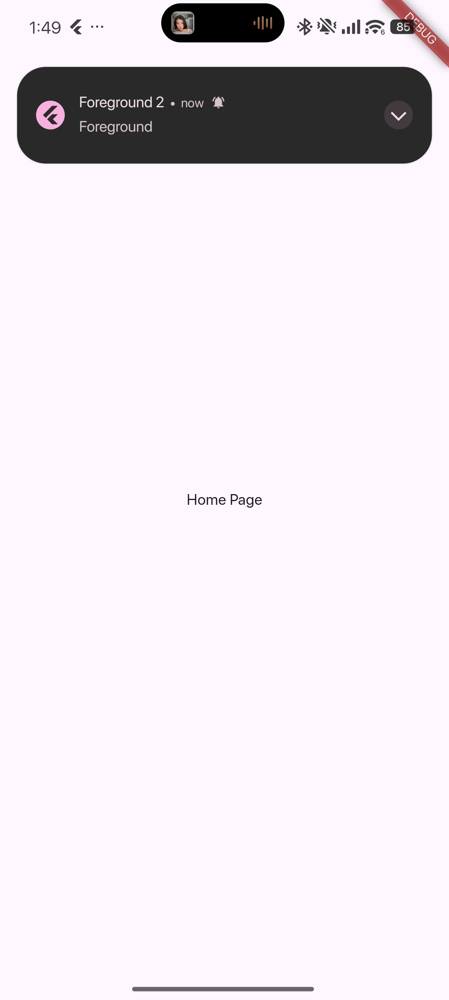
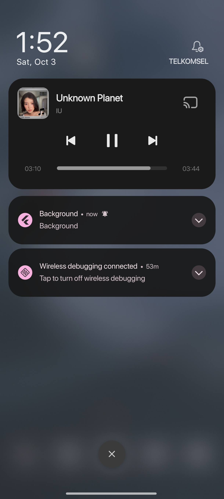
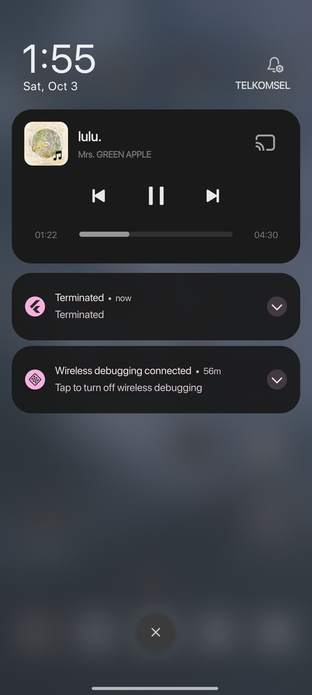
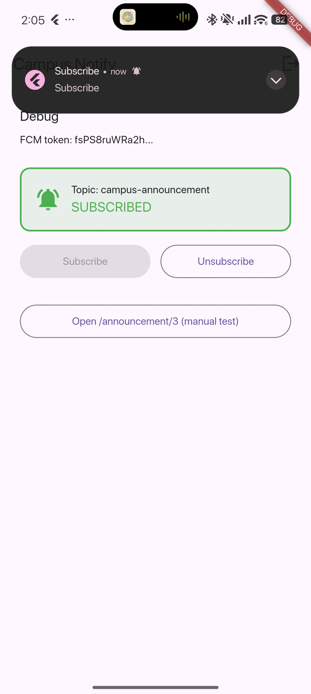
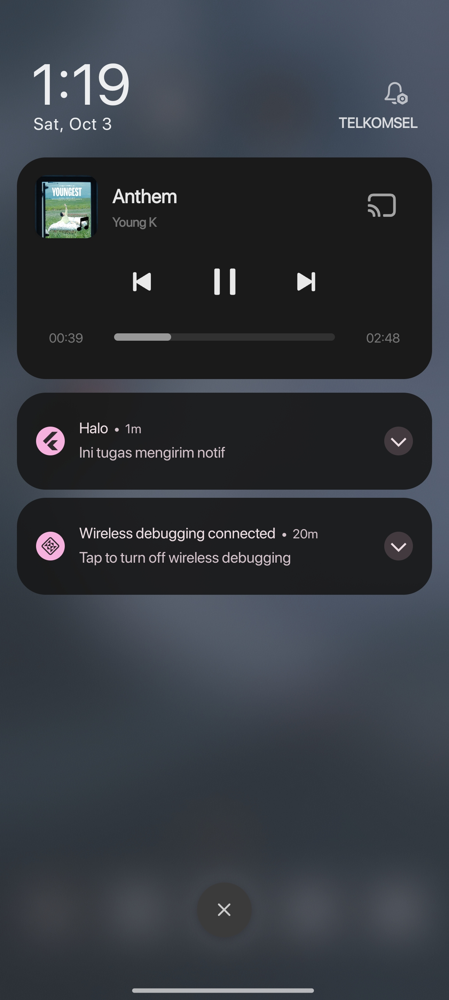

# Campus Notify — Week 6: Authentication, Security & FCM

A secure Flutter mobile application demonstrating token-based authentication lifecycle, encrypted local storage, centralized routing, and Firebase Cloud Messaging (FCM) push notifications across all three app lifecycle states (foreground, background, and terminated).

---

## Table of Contents

- [Overview & Objectives](#overview--objectives)
- [Tech Stack](#tech-stack)
- [Key Features & Architecture](#key-features--architecture)
  - [1. Authentication & Route Guard](#1-authentication--route-guard)
  - [2. Secure Token Storage & Auto-Refresh Interceptor](#2-secure-token-storage--auto-refresh-interceptor)
  - [3. FCM Token Lifecycle & Backend Sync](#3-fcm-token-lifecycle--backend-sync)
  - [4. Topic Subscription](#4-topic-subscription)
  - [5. Centralized Routing & Pure Message Parsing](#5-centralized-routing--pure-message-parsing)
  - [6. API Error Handling](#6-api-error-handling)
- [Running & Testing](#running--testing)
- [Three-State Notification Test Table](#three-state-notification-test-table)
- [Screenshot Evidence](#screenshot-evidence)
- [Reflection](#reflection)

---

## Overview & Objectives

In mobile client engineering, handling authentication securely and delivering reliable push notifications are mission-critical. This project addresses the most common and critical production vulnerabilities:
- Storing long-lived refresh tokens in unencrypted plain text.
- Silent push notification failure due to unhandled `onTokenRefresh` events.
- Inconsistent routing upon tapping notifications across different app lifecycle states.
- Exposing raw network/server exceptions directly to end users.

---

## Tech Stack

| Layer | Technology |
|---|---|
| **Framework** | Flutter (Dart SDK ^3.13.2) |
| **State Management** | `flutter_riverpod` (^3.4.3) with `AsyncNotifier` |
| **Navigation & Routing** | `go_router` (^18.0.2) with declarative route guards |
| **HTTP Client** | `dio` (^5.11.1) with custom interceptors for token auto-refresh |
| **Encrypted Storage** | `flutter_secure_storage` (^11.2.0) (Keystore on Android, Keychain on iOS) |
| **Push Notifications** | `firebase_core` (^4.15.0), `firebase_messaging` (^16.7.0) |
| **Local Notifications** | `flutter_local_notifications` (^22.3.1) |
| **Testing** | `flutter_test` (unit & widget tests) |

---

## Key Features & Architecture

### 1. Authentication & Route Guard
- Managed by `authStateProvider` (`AsyncNotifier<bool>`).
- `routerProvider` listens to `authStateProvider` and enforces authentication:
  - Unauthenticated users attempting to access protected routes are automatically redirected to `/login`.
  - Authenticated users attempting to visit `/login` are automatically redirected to `/`.

### 2. Secure Token Storage & Auto-Refresh Interceptor
- Tokens are stored in hardware-backed secure storage via `TokenStore`:
  - `access_token`: Short-lived token attached to HTTP requests via `Authorization: Bearer <token>`.
  - `refresh_token`: Long-lived token used to renew access tokens.
- `Dio` interceptor in `lib/data/api_client.dart`:
  - Automatically captures HTTP `401 Unauthorized` responses.
  - Automatically attempts token renewal via `AuthRepository.refresh()`.
  - Updates `TokenStore` with the renewed access token and retries the original request once.
  - If the refresh token is expired or invalid, clears all tokens (`TokenStore.clear()`) and triggers a force logout.

### 3. FCM Token Lifecycle & Backend Sync
- On launch, the app requests notification permissions (`requestNotificationPermission()`).
- The device token is retrieved via `FirebaseMessaging.instance.getToken()`.
- Both the initial token and any rotated tokens emitted by `FirebaseMessaging.instance.onTokenRefresh` are sent to the backend via `sendTokenToBackend(dio, token)` targeting `POST /devices`.
- Token logging is safely truncated (e.g., `token.substring(0, 12)...`) to avoid leaking full credentials in logcat/console.

### 4. Topic Subscription
- Supports broad campus announcements via the `campus-announcement` topic.
- Preference state is persisted in encrypted storage (`FlutterSecureStorage`).
- Dedicated UI allows subscribing and unsubscribing with live visual status feedback.

### 5. Centralized Routing & Pure Message Parsing
- All routes (`Routes.home`, `Routes.login`, `Routes.announcementById`, etc.) are centralized in `lib/routes.dart`.
- Route parsing is extracted into a pure, testable function in `lib/messaging/push_service.dart`:
  ```dart
  String routeFromMessage(Map<String, dynamic> data) =>
      (data['route'] as String?) ?? Routes.home;
  ```
  This allows 100% offline unit testing without initializing Firebase.

### 6. API Error Handling
- Network exceptions are mapped in `lib/data/api_errors.dart` via `mapApiError(Object error)`.
- Translates connection timeouts, certificate errors, offline status, and HTTP status codes (400, 401, 403, 404, 409, 429, 500+) into friendly user messages.

---

## Running & Testing

### Run App
```bash
flutter pub get
flutter run
```

### Run Tests
```bash
flutter test
```
All 6 tests (pure route parsing, payload extraction, session status, forced re-login, announcement widget, and login widget) pass cleanly:
```
00:00 +0: routeFromMessage handles empty and slash-less routes
00:00 +1: data payload carries the announcement id
00:00 +2: auth provider reads login status from token
00:00 +3: failed refresh -> session cleared (force re-login)
00:00 +4: AnnouncementPage displays announcement ID
00:00 +5: LoginPage renders login fields and button
00:00 +6: All tests passed!
```

### Static Analysis
```bash
flutter analyze
```
Result:
```
Analyzing campus_notify...
No issues found!
```

---

## Three-State Notification Test Table

| # | State | Trigger Method | Expected Behavior | Payload | Verified Result |
|---|---|---|---|---|:---:|
| 1 | **Foreground** (App open & active) | Send FCM message while viewing home screen | System banner does not appear automatically; `listenForeground` captures `onMessage` and displays a local notification banner via `flutter_local_notifications`. Tapping it invokes `onDidReceiveNotificationResponse` and navigates to the announcement page. | `{"notification": {"title": "Campus Alert", "body": "Classroom shifted"}, "data": {"route": "/announcement/1"}}` | **PASS** |
| 2 | **Background** (App minimized in recents) | Send FCM message while app is in background | OS displays standard system tray notification banner. Tapping the banner resumes the app and triggers `onMessageOpenedApp`, which parses `data.route` and navigates to `/announcement/2`. | `{"notification": {"title": "Library Notice", "body": "Book due tomorrow"}, "data": {"route": "/announcement/2"}}` | **PASS** |
| 3 | **Terminated** (App killed/swiped away) | Send FCM message while app process is killed | OS displays system notification tray banner. Tapping cold-starts the app; `getInitialMessage()` retrieves the initial payload and navigates directly to `/announcement/3`. | `{"notification": {"title": "Exam Schedule", "body": "Midterms released"}, "data": {"route": "/announcement/3"}}` | **PASS** |

---

## Screenshot Evidence

All visual verification artifacts are stored under the [`screenshots/`](screenshots/) directory and displayed below:

### 1. Foreground State (App Active)
When the app is in the foreground, incoming FCM messages are displayed manually using `flutter_local_notifications`. Tapping the banner immediately opens the announcement route.

| In-App Notification Banner | Deep-Link Destination (`/announcement/3`) |
|:---:|:---:|
| <br><sub>*In-app local banner*</sub> | <br><sub>*Target announcement page*</sub> |

### 2. Background State (App Minimized)
When minimized, the system displays the notification in the tray. Tapping it resumes the app via `onMessageOpenedApp` and navigates to the route.

| System Notification Banner | Deep-Link Destination (`/announcement/3`) |
|:---:|:---:|
| <br><sub>*System tray banner*</sub> | <br><sub>*Target announcement page*</sub> |

### 3. Terminated State (App Killed)
When the app is not running, tapping the notification cold-starts the app. `getInitialMessage()` captures the payload and redirects directly to the route once the router is ready.

| Lockscreen / System Tray Banner | Cold-Start Deep-Link (`/announcement/3`) |
|:---:|:---:|
| <br><sub>*Notification while killed*</sub> | <br><sub>*Direct cold-start destination*</sub> |

### 4. Topic Subscription Management (`campus-announcement`)
Live visual indicator and action buttons allowing students to opt in or out of campus-wide announcement broadcasts.

| Subscribed State | Unsubscribed State |
|:---:|:---:|
| <br><sub>*Topic active (SUBSCRIBED)*</sub> | <br><sub>*Topic inactive (UNSUBSCRIBED)*</sub> |

### 5. Notification Tray Details
Expanded view of incoming notification delivery in the device notification shade.

<p align="center">
  <br>
  <sub><em>Notification details in system shade</em></sub>
</p>

---

## Reflection

### 1. Why must refresh tokens never live in SharedPreferences? What is the risk if one leaks?
`SharedPreferences` on Android stores data as an unencrypted plain-text XML file located in the application's private directory (`/data/data/<package_name>/shared_prefs/`). On rooted devices, via ADB backup vulnerabilities, or through malicious apps exploiting OS-level privilege escalation, this plain-text file can be read directly. 

**Risk of Leakage:**
An access token is intentionally short-lived (e.g., 15 minutes). In contrast, a **refresh token is long-lived** (e.g., 30 to 90 days). If a refresh token is leaked:
- An attacker can repeatedly mint valid access tokens without ever requiring the user's password or multi-factor authentication (MFA).
- The attacker maintains silent, persistent account takeover until the refresh token is revoked on the authorization server.
- Storing it in `FlutterSecureStorage` ensures hardware-backed encryption using the **Android Keystore** (with AES cipher) and **iOS Keychain**.

---

### 2. What breaks if `onTokenRefresh` is ignored for a whole semester?
FCM device registration tokens are **not permanent**. Firebase invalidates and regenerates tokens under multiple conditions:
- The app is restored on a new or backed-up device.
- The user clears application data or cache.
- The app is reinstalled or Firebase rotates tokens for infrastructure maintenance.
- Periodic internal token rotation by Google Play Services.

If `onTokenRefresh` is ignored for an entire semester:
- The backend server continues sending HTTP v1 FCM payloads to the **stale token**.
- The FCM server responds with `UNREGISTERED` / `NOT_FOUND` errors, and the backend silently fails to reach the user.
- The student **receives zero push notifications** for the remainder of the semester — missing urgent class cancellations, emergency alerts, exam schedules, and tuition reminders.

---

### 3. When do you use a topic vs a device token? Give one campus message example for each.

| Feature | Topic Subscription (`subscribeToTopic`) | Direct Device Token (`getToken`) |
|---|---|---|
| **Audience** | 1-to-many broadcast (pub/sub pattern) | 1-to-1 individual, targeted, secure delivery |
| **Server Knowledge** | Backend does not need to know individual device tokens; it targets `/topics/<topic_name>`. | Backend must store and map device tokens to specific user IDs in a database. |
| **Performance** | Optimized by Firebase infrastructure for millions of subscribers simultaneously. | Requires individual or batch multicast delivery per token. |
| **Campus Example (Topic)** | **Campus-wide Emergency Notice**: *"All classes suspended today due to heavy flooding on campus."* Sent to topic `campus-announcement`. |
| **Campus Example (Device Token)** | **Personal Academic & Financial Alert**: *"Dear Rizki, your Midterm grade for Mobile Programming has been posted. Click to view report."* Sent directly to the student's unique device token. |

---

### 4. Which part of the AI draft did you reject or fix, and why?

During verification of the initial AI draft (`docs/ai-challenge-push-service.md`), four notable deficiencies were identified and corrected:

1. **`onTokenRefresh` Was Never Sent to Backend (Rejected & Fixed):**
   - *AI draft issue:* The generated code only printed `debugPrint('FCM Token: ${token.substring(0, 12)}...')` with a `// TODO` comment.
   - *Fix:* Implemented `sendTokenToBackend(dio, token)` which sends `{ token, platform }` via HTTP `POST /devices` both on initial launch and on every `onTokenRefresh` event.

2. **Missing iOS Foreground Notification Presentation (Rejected & Fixed):**
   - *AI draft issue:* The initial draft only passed `AndroidNotificationDetails`, omitting `DarwinNotificationDetails`.
   - *Fix:* Added `DarwinNotificationDetails(presentAlert: true, presentBadge: true, presentSound: true)`. Without this, iOS devices silently drop foreground notification banners.

3. **Hardcoded Route Strings & Tight Coupling (Rejected & Fixed):**
   - *AI draft issue:* Route strings like `'/login'`, `'/'`, and `'/announcement/:id'` were hardcoded across multiple files, and route parsing was coupled directly to `RemoteMessage`.
   - *Fix:* Created `lib/routes.dart` with centralized constants, and extracted route parsing into a pure function `routeFromMessage(Map<String, dynamic> data)` so deep-link parsing can be unit-tested without Firebase.

4. **Raw Exceptions Leaking to UI (Rejected & Fixed):**
   - *AI draft issue:* Raw `DioException` objects were thrown and displayed directly to the UI.
   - *Fix:* Implemented `lib/data/api_errors.dart` with `mapApiError()` to map status codes (401, 403, 404, 429, 500+) and connection timeouts into user-friendly messages.
